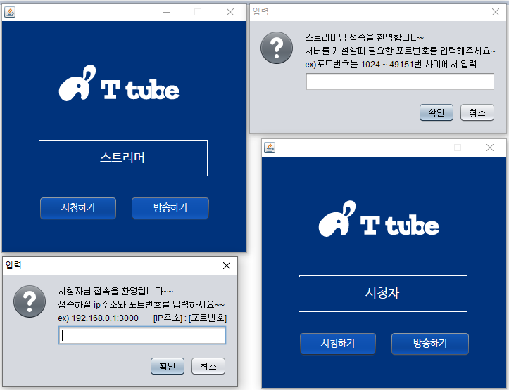
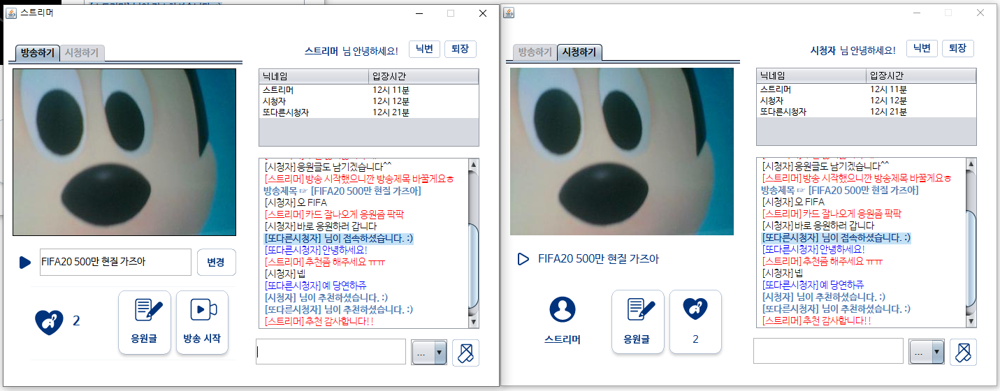
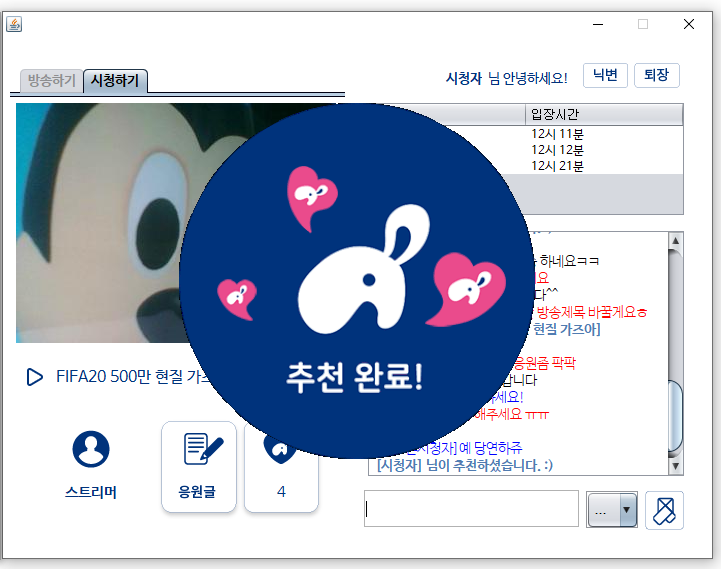
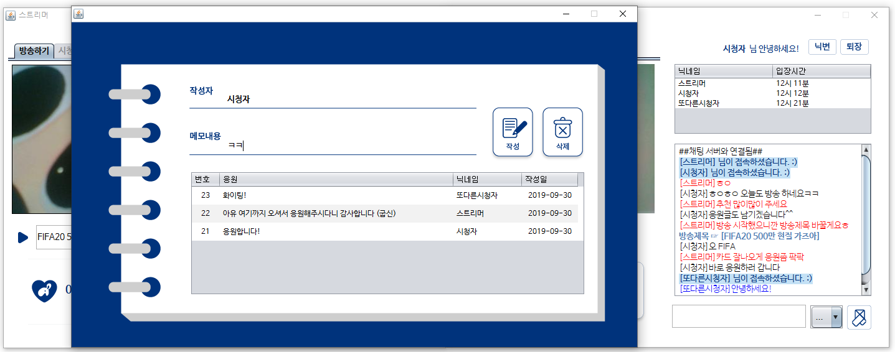
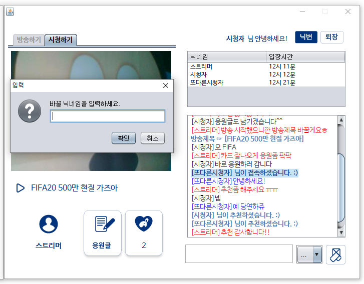
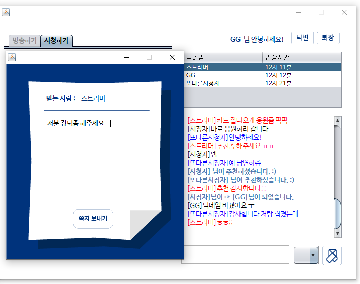
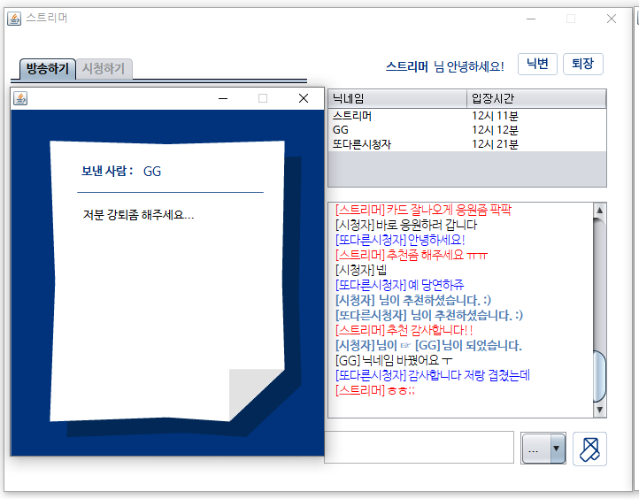

# tTube

## 1. 목차
```
.tTube 실시간 인터넷 방송 스트리밍 프로그램
├── 1.목차
├── 2.개요
├── 3.특징
├── 4.사용법
|   ├── 4.1.개발 환경 & 개발 툴
|   └── 4.2.실행 방법
|       ├── 4.2.1 실행 환경 세팅
|       └── 4.2.2 실행
└── 5.스크린샷
    ├── 5.1.로그인 화면
    ├── 5.2.실행 화면
    ├── 5.3.추천 화면
    ├── 5.4.게시판 화면
    ├── 5.5.닉네임 변경 화면
    ├── 5.6.쪽지 발신 화면
    └── 5.7.쪽지 수신 화면
```


## 2. 개요
 - **JAVA**로 구현한 **실시간 인터넷 방송 스트리밍 프로그램**입니다. 
 - Java 네트워크 프로그래밍 TCP, UDP Server Socket 통신과 데이터베이스를 이용한 프로젝트입니다.


 
## 3. 특징
- 영상 송수신은 UDP, 실시간 채팅 및 쪽지 송수신은 TCP통신을 사용했습니다.
- 방송을 하는 사람은 포트번호를 입력해야 하고(UDP) 시청하는 사람은 방송하는 사람의 ip주소와 포트번호를 입력해서 접속합니다.
- 웹 캠 영상은 프레일 별로 이미지를 만들어 ByteArrayInputStream에 담아 전송하고 받습니다.
- 해당 방송에 접속한 사람은 실시간 채팅이 가능합니다.
- 해당 방송에 접속한 유저 목록이 뜨면 해당 유저를 클릭하면 쪽지를 보낼수 있습니다.
- 해당 스트리머를 추천하는 추천하기 기능과 응원글을 남길 수 있는 게시판을 구현하였습니다.
- 닉네임 변경과 방제목 변경 기능을 적용했습니다.


## 4. 사용법
### 4.1. 개발 환경 & 개발 툴
- Programing Language :　Java 8 (JDBC, Java Network 활용) 
- DBMS : Oracle 11g
- OS : Windows 10
-----------------------------------------------------------------------------
- Tool : Eclipse, NetBeans, SQL Developer, StarUML(usecase) 
- Graphic Tool : Adobe Photoshop CC


### 4.2. 실행 방법
#### 4.2.1 실행환경 세팅
```
# 1. Eclipse에 해당 프로젝트를 import 합니다.
# 2. 해당 프로젝트는 웹캠 드라이버를 인식해야 하므로 외부 라이브러리를 추가해야합니다.
-https://github.com/sarxos/webcam-capture 에서 bridj-0.6.2.jar, slf4j-api-1.7.2.jar, webcam-capture-0.3.10.jar 파일을 다운받아 추가하면 됩니다.
# 3. 영상은 UDP방식으로 전송하기 때문에 어떤 ip주소로 전송을 할지 설정해야 합니다. tTubeUdpServer.java 파일에서 UDPserverStart메소드에서 ia부분을 수정하시면 됩니다.
# 4. 게시판 기능을 이용하기 위해서는 테이블을 추가해야합니다. tTube.sql 파일로 테이블을 추가하시기 바랍니다.
# 5. 이렇게 하면 세팅은 완료됩니다.
```
#### 4.2.2 실행
```
# 1. 설정이 완료되면 tTubeLogin.java가 열려있는 상태에서 RUN 하시면 됩니다.
# 2. 방송하기, 시청하기 설정 후 ip주소 또는 포트번호를 입력하여 사용하시면 됩니다.
```


## 5. 스크린샷

### 5.1.로그인 화면
 
 -------------

### 5.2. 실행 화면
 
 -------------
 
 ### 5.3. 추천 화면
 
 -------------
  
 ### 5.4. 게시판 화면
 
 -------------
  
 ### 5.5. 닉네임 변경 화면
 
 -------------
 
  ### 5.6. 쪽지 발신 화면
 
 -------------
 
  ### 5.7. 쪽지 수신 화면
 
 -------------
 
------------------------------------------------------------------------------
# 감사합니다!
